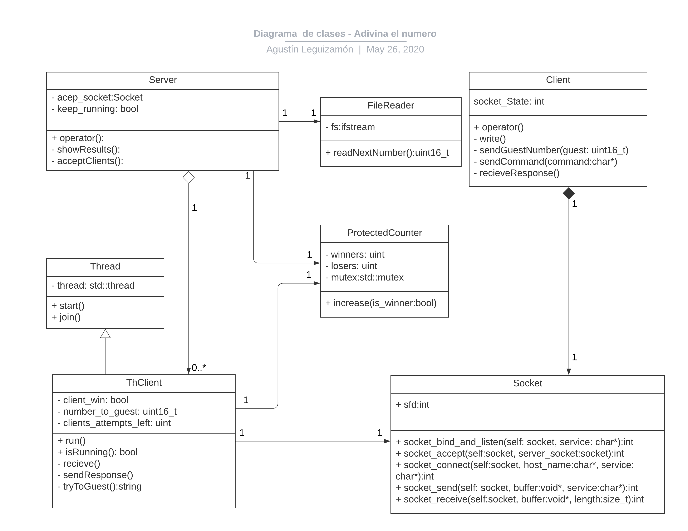

# Trabajo práctico Nro 3
## Adivina el número

Estudiante: Agustin Manuel Leguizamón

Padrón: 99535

Link Github: https://github.com/AgustinLeguizamon/tp3

Instancia de entrega: 2

### Introducción:
En el siguiente diagrama de clases se resaltan las relaciones entre las clases más relevantes en cuanto a la implementación.

Figura 1 - Diagrama de clases

### Solución planteada:

A continuación se dará una breve explicación de cada una de las clases implementadas para la resolución de este trabajo práctico.

Tenemos el hilo **Server** encargado de leer el archivo con los números a adivinar. El hilo "aceptador" se encarga de aceptar nuevas conexiones con los clientes y lanzar los hilos **ThClient** que se encargan de comunicarse con cada cliente y de la lógica del juego.

#### FileReader

Encargado de abrir y leer el archivo (server.list) con los números, es llamado por **Server** cada vez que este necesita un nuevo número, función `readNextNumber`.

#### Server

Encargado de levantar el server en el puerto/servicio que recibe como argumento el programa, ligando el socket acep al puerto `bindAndListen` en el constructor. Luego se lanza un hilo `acep_th` que se encarga de aceptar nuevos clientes y lanzar los hilos `ThClient` con el socket peer.
Mientras tanto el hilo principal del server espera al ingreso del caracter 'q' por entrada estándar en cuyo caso hace el join de cada hilo `ThClient` y cerrando el socket aceptador de manera de evitar nuevas conexiones.
Finalmente cierra el hilo aceptador liberando los recursos y muestra los resultados de las partidas en pantalla.

#### ThClient

Cada vez que un nuevo cliente se conecta, un nuevo hilo ThClient es lanzado con el socket aceptado. Esta clase se encarga de la comunicación con el cliente para el juego. Una vez que el cliente finaliza la partida el hilo entra en estado "joinable".
Todos los ThClient comparten un contador con la cantidad de ganadores y perdedores (este está protegido por un mutex).
El constructor por copia es utilizado dado que cada hilo se guarda en un vector, y de esta manera evitamos la copia. También el socket tiene constructor por copia de manera de poder retornarlo en la función `Socket::accept`. 

#### ProtectedCounter

Lleva la cuenta de cuántos clientes han perdido o ganado.
Cada vez que un juego finaliza se incrementa el contador correspondiente. Protegido por un mutex al estar compartido por todos los hilos **ThClient**.

#### Game

Encargado de la lógica del juego.
Cada juego tiene un número que debe ser adivinado por el cliente y una cantidad de intentos. 
**Game** recibe los comandos 'h', 's' o un número y escribe un mensaje con la información para ser enviada al cliente dependiendo del comando. En el caso de recibir un número este es el que se compara digito a digito con aquel que tiene que ser adivinado para ganar. El juego termina cuando adivina, se queda sin intentos o recibe el comando 's' (Surrender).

#### Client

Cada cliente es un programa con un socket `client_socket` cuyo constructor se conecta al server y espera por entrada estándar el ingreso de los comandos válidos, estos son verificados y luego enviados por el socket al server (ThClient), luego reciben la respuesta que se imprime por salida estándar.

#### CommandFactory
Design pattern Factory, recibe por parámetro un string de la entrada estándar y dependiendo del tipo devuelve un puntero a **Command**. Existen tres casos, si el input es "RENDIRSE" devuelve un puntero a **Surrender**, si es "AYUDA" devuelve **Help** y en el caso de un número válido devuelve **Number**.
Todos responden al operator() de manera polimórfica que será detallada a continuación.

##### Surrender
Delega a **Protocol** el envío por socket del caracter 's'.

##### Help
Delega a **Protocol** el envío por socket del carácter 'h'.

##### Number
Delega a **Protocol** el envio por socket del caracter 'n'.
Delega a **Protocol** el envío por socket del número con el que se construyó con **CommandFactory**

#### Protocol
Encargado de la lógica de envío y recepción de las tiras de bytes entre los sockets del cliente y el servidor. También del pasado al endianess del network al local y viceversa.

#### Excepciones

Hay dos tipos de excepciones en este trabajo. Una genérica llamada **OSError** que posee una cantidad de parámetros variables en donde se puede detallar el tipo de error. Esta es utilizada para las excepciones en el **Socket** cuando ocurre un problema en el creación del socket o al intentar establecer un canal de comunicación y el **FileReader** por si el archivo falla al abrir.
La segunda excepción es **ClosedSocketException** lanzada en el momento que falla el socket aceptador, cosa que se espera en el momento del cierre del servidor y para evitar nuevo ingreso de clientes y orquestar la liberación de los recursos.

#### Comentarios de la entrega

El polimorfismo se aplicó en la clase **Client** utilizando el design pattern Factory aplicado a los comandos (CommandFactory). En el caso del **ThClient** simplemente se resuelve delegando la tarea a **Game**, aunque también se pudo haber utilizado el CommandFactory.

