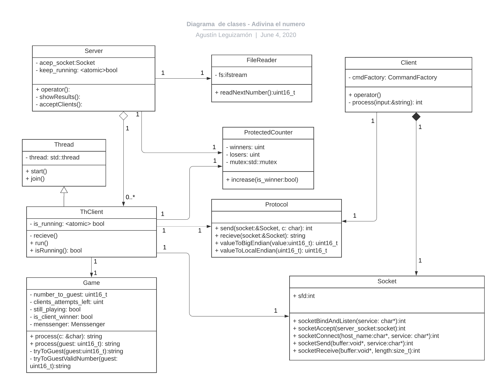

# Trabajo práctico Nro 3
## Adivina el número

Estudiante: Agustin Manuel Leguizamón

Padrón: 99535

Link Github: https://github.com/AgustinLeguizamon/tp3

Instancia de entrega: 1

### Introducción:
En el siguiente diagrama de clases se resaltan las relaciones entre las clases más relevantes en cuanto a la implementación.

Figura 1 - Diagrama de clases

### Solución planteada:

A continuación se dará una breve explicación de cada una de las clases implementadas para la resolución de este trabajo práctico.

Tenemos el hilo **Server** encargado de leer el archivo con los números a adivinar. El hilo "aceptador" se encarga de aceptar nuevas conexiones con los clientes y lanzar los hilos **ThClient** que se encargan de comunicarse con cada cliente y de la lógica del juego.

#### FileReader

Encargado de abrir y leer el archivo (server.list) con los números, es llamado por **Server** cada vez que este necesita un nuevo número, función `readNextNumber`.

#### Server

Encargado de levantar el server en el puerto/servicio que recibe como argumento el programa, ligando el socket acep al puerto `bindAndListen` en el constructor. Luego se lanza un hilo `acep_th` que se encarga de aceptar nuevos clientes y lanzar los hilos `ThClient` con el socket peer.
Mientras tanto el hilo principal del server espera al ingreso del caracter 'q' por entrada estándar en cuyo caso hace el join de cada hilo `ThClient` y cerrando el socket aceptador de manera de evitar nuevas conexiones.
Finalmente cierra el hilo aceptador liberando los recursos y muestra los resultados de las partidas en pantalla.

#### ThClient

Encargado de la lógica del juego, cada vez que un nuevo cliente se conecta, un nuevo hilo ThClient es lanzado con el socket aceptado. Esta clase se encarga de la comunicación con el cliente para el juego. Una vez que el cliente finaliza la partida el hilo entra en estado "joinable".
Todos los ThClient comparten un contador con la cantidad de ganadores y perdedores (este está protegido por un mutex).
El constructor por copia es utilizado dado que cada hilo se guarda en un vector, y de esta manera evitamos la copia. También el socket tiene constructor por copia de manera de poder retornarlo en la función `Socket::accept`. 

#### Client

Cada cliente es un programa con un socket `client_socket` cuyo constructor se conecta al server y espera por entrada estándar el ingreso de los comandos válidos, estos son verificados y luego enviados por el socket al server (ThClient), luego reciben la respuesta que se imprime por salida estándar.

#### Comentarios de la entrega

1. Para el envío de strings se utilizan dos send/recieve es decir que el primer send/recv envía el uint32 con el largo del mensaje y luego el segundo send/recv es para el string en sí. Es decir que no se envía el uint32 y el string en un solo send en ambos sentidos.
**Nota:** No se si esto se considera válido o es obligatorio que en un único send este tanto el uint32 y el string.

2. El cierre de cliente se encuentra hecho de manera que verifica si recibe el string Ganaste o Perdiste lo que es poco práctico pero caso contrario el cliente debía intentar ingresar un numero valido para que recién falle el send y de esa manera cerrar el socket cliente.

3. Al momento de agregar los hilos ThCLient al vector 'clients' se hace un `clients.reserve` dado que al no hacerlo se produce un error y la terminación del programa, como no pude encontrar una solución definitiva, la reserva de memoria está fijada a un valor arbitrario con `MAX_CLIENTS`

4. Al dejarlo como última tarea el manejo de excepciones cubre una mínima parte del trabajo práctico.
Particularmente intente crear una excepción `OSError` pero su uso resultaba en una excepción del tipo double free y por eso se encuentra sin utilizar.

5. El cliente debe terminar de jugar para que el server pueda terminar de liberar los recursos.
